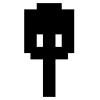

	<a>
		
		<h1 align="center">
			Kiwi: Airborne
		</h1>
	</a>

	
	

> Side-scroller game where you help a Kiwi fulfill its dream of flying; for the 2020 Open Jam

---

# About
Kiwi: Airborne, is a 2D side-scroller, made with [Godot](https://github.com/godotengine/godot), in which you help a Kiwi fulfill its dream of flight, all while attempting to overcome the various obstacles in its way; inspired by the short film [Kiwi!](https://www.youtube.com/watch?v=sdUUx5FdySs)

## [Open Jam 2020, Theme: Airborne](https://itch.io/jam/open-jam-2020)
Open Jam is a game jam with 🖤.  At Open Jam, you build an open-source video game over the weekend, rate other creators’ games, and compete for delicious open source karma.   Open Jam is a game jam that promotes open source games and game creation tools. 

*Using open source tools is highly encouraged!*

## Open Source Usage
This game wouldn't be possible without all the awesome and open source tools listed below:
 - [Godot](https://github.com/godotengine/godot)
 - [Krita](https://invent.kde.org/graphics/krita)
 - [Notepad++](https://github.com/notepad-plus-plus/notepad-plus-plus)
 - [Audacity](https://github.com/audacity/audacity)
 - [FontLibrary](https://fontlibrary.org/en)
   - [Cave-Story](https://fontlibrary.org/en/font/cave-story)
 - [Youtube-Audiolibrary](https://youtube.com/audiolibrary/music)
   - Ride of the Valkyries (by Wagner)
   - Swoosh
   - Mechanical_Clock_Ring
   - Ship_Bell
 - [OpenGameArt](https://opengameart.org/)
   - [Arrow hit twang](https://opengameart.org/content/arrow-hit-twang)
 
